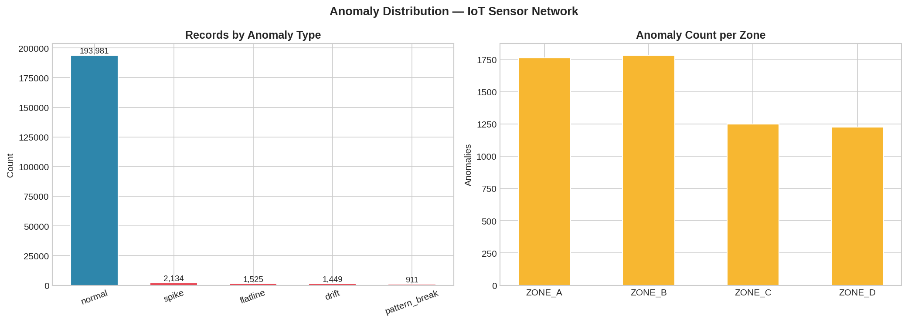
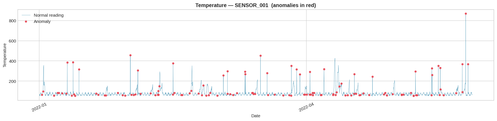
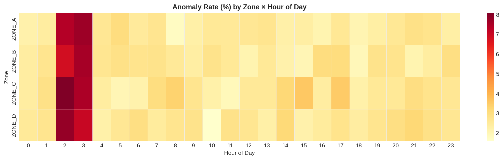
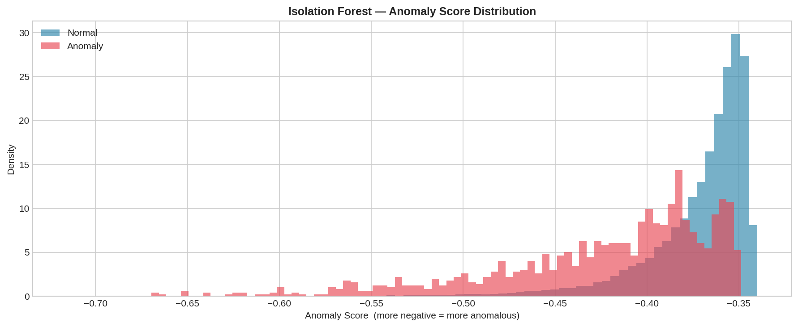
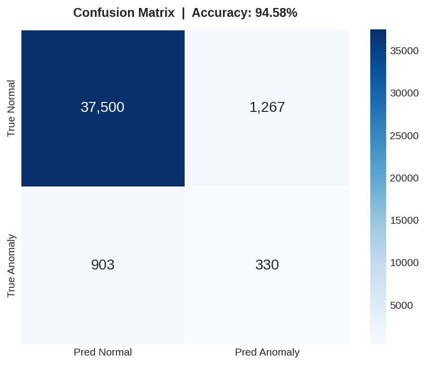
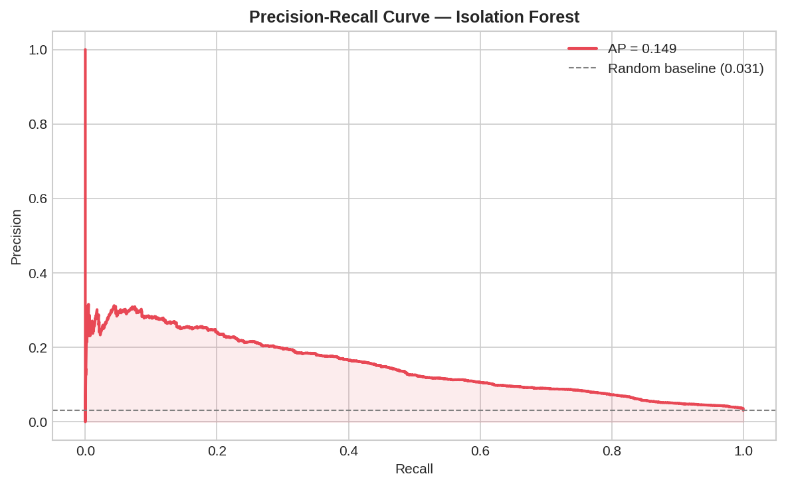

# IoT Sensor Anomaly & Fraud Pattern Detection


**Author:** Dharani Bhumireddy
**MS Data Science** — University at Albany, SUNY · GPA 3.7
**B.Tech ECE** — SCSVMV University · GPA 3.8
**Contact:** dharanibhumireddy.ds@gmail.com
**LinkedIn:** [linkedin.com/in/dharani-bhumireddy](https://linkedin.com/in/dharani-bhumireddy)

---

## Table of Contents

1. [Problem Statement](#1-problem-statement)
2. [Why This Project Matters](#2-why-this-project-matters)
3. [Dataset](#3-dataset)
4. [Anomaly Types](#4-anomaly-types)
5. [Pipeline Architecture](#5-pipeline-architecture)
6. [Feature Engineering](#6-feature-engineering)
7. [ARIMA Statistical Baseline](#7-arima-statistical-baseline)
8. [Isolation Forest Model](#8-isolation-forest-model)
9. [Why Isolation Forest](#9-why-isolation-forest)
10. [Hyperparameter Tuning](#10-hyperparameter-tuning)
11. [Alert Engine](#11-alert-engine)
12. [Results](#12-results)
13. [Visualizations](#13-visualizations)
14. [Project Structure](#14-project-structure)
15. [Setup and Installation](#15-setup-and-installation)
16. [How to Run](#16-how-to-run)
17. [Running the Tests](#17-running-the-tests)
18. [Configuration](#18-configuration)
19. [Logging](#19-logging)
20. [Real-World Applications](#20-real-world-applications)
21. [Technical Stack](#21-technical-stack)

---

## 1. Problem Statement

An industrial IoT sensor network spans **50 sensors across 4 zones** — factory floor, HVAC, power distribution, and outdoor perimeter. Each sensor reports temperature, pressure, vibration, and power draw continuously, producing **over 1 million records** across a two-year window.

The network had no automated system to detect abnormal sensor behavior. Problems including sensor tampering, power theft, equipment failures, and unauthorized after-hours access were going completely undetected because:

- The data volume (1M+ records) makes manual review impossible
- Anomalies are rare (~3%) and easy to miss in raw numbers
- Some anomaly types (drift, pattern breaks) develop slowly and are invisible without time-series context
- No labeled training data existed — a supervised model was not an option

The question: *can we automatically flag suspicious sensor behavior in near real-time before it causes damage or financial loss?*

---

## 2. Why This Project Matters

This problem is not limited to industrial sensors. The same detection patterns apply directly to:

- **Healthcare fraud** — unusual billing patterns at odd hours
- **Financial fraud** — transaction anomalies deviating from normal customer behavior
- **Network security** — traffic spikes and after-hours access on corporate networks
- **Supply chain** — sensor drift in cold-chain pharmaceutical monitoring
- **Utilities** — smart meter tampering and unauthorized energy consumption

The pipeline here — ARIMA baseline + Isolation Forest + alert engine — is the same architecture used in production fraud detection at financial institutions and healthcare insurers. The only difference is the domain of the input data.

---

## 3. Dataset

The dataset is generated synthetically using `src/data_generator.py` because real industrial IoT fraud datasets are proprietary. The generation logic mirrors real sensor behavior documented in industrial IoT security literature.

### Scale

| Dimension | Value |
|---|---|
| Total records | 1,000,000 |
| Number of sensors | 50 |
| Date range | January 2022 to January 2024 |
| Anomaly rate | 3.00% (30,000 records) |
| Raw file size | ~80 MB |
| Feature matrix size | ~200 MB after engineering |

### Sensor Zones

| Zone | Sensors | Environment | Typical Use |
|---|---|---|---|
| ZONE_A | SENSOR_001 to SENSOR_015 | Industrial floor | Heavy machinery, high vibration |
| ZONE_B | SENSOR_016 to SENSOR_030 | HVAC units | Moderate heat, low vibration |
| ZONE_C | SENSOR_031 to SENSOR_040 | Power distribution | High power draw, moderate heat |
| ZONE_D | SENSOR_041 to SENSOR_050 | Outdoor perimeter | Variable temperature, low power |

### Raw Columns

| Column | Type | Description |
|---|---|---|
| timestamp | datetime | Reading datetime (2022 to 2024) |
| sensor_id | string | SENSOR_001 to SENSOR_050 |
| zone | string | ZONE_A, B, C, or D |
| temperature | float | Temperature in degrees Fahrenheit |
| pressure | float | Pressure in PSI |
| vibration | float | Vibration level (absolute value) |
| power_draw | float | Power consumption in watts |
| is_anomaly | int | Ground truth: 0 = normal, 1 = anomaly |
| anomaly_type | string | normal / spike / flatline / drift / pattern_break |

### Anomaly Breakdown (from actual run)

| Type | Count | Share |
|---|---|---|
| spike | 10,509 | 35.0% |
| flatline | 7,474 | 24.9% |
| drift | 7,468 | 24.9% |
| pattern_break | 4,549 | 15.2% |

> The CSV is not committed to this repository because it is 80MB+.
> Run `python main.py --quick` to generate it locally in about 2 minutes.
> See [data/README.md](data/README.md) for full instructions.

---

## 4. Anomaly Types

Four types of anomalies are injected, each mapping to a real-world fraud or abuse pattern.

### Spike
A sensor reading jumps to 3.5 to 6 times its normal range in a single record.

**Real-world equivalent:** Sensor tampering, power surge, meter bypass, or deliberate injection of false data to trigger a safety shutdown or override a threshold alarm.

**How detected:** The first-order rate-of-change feature (diff1) jumps sharply. The current reading falls far outside the sensor's rolling mean window. The zone deviation z-score spikes if other sensors in the zone are behaving normally.

### Flatline
The sensor reports the same value for 10 or more consecutive records. Vibration drops to exactly zero.

**Real-world equivalent:** A dead sensor (hardware failure), or a spoofed sensor replaying a recorded value to hide actual activity. Common in smart-meter fraud where a constant low reading is injected to underreport consumption.

**How detected:** Rolling standard deviation collapses to zero. Lag features (t-1, t-2, t-3) become identical to the current value. The zone deviation z-score may also flag it if other zone sensors are still varying normally.

### Drift
The reading increases slowly and linearly over 20 consecutive records. Not a sudden jump — a consistent upward creep.

**Real-world equivalent:** Calibration drift (sensor needs recalibration), a slow refrigerant or gas leak in HVAC, or gradual overheating in power distribution equipment. The danger is that drift is invisible to threshold-based alerts — the value never crosses a hard ceiling, it just keeps climbing.

**How detected:** Second-order difference (diff2) stays consistently positive over the window. Rolling max diverges at different window sizes. ARIMA flags the residuals because the model expects mean-reverting behavior but sees a directional trend.

### Pattern Break
The sensor timestamp is shifted to 2–4am and power draw is increased by 1.8 to 3 times.

**Real-world equivalent:** Unauthorized after-hours access to equipment. Someone using industrial machinery outside normal hours, accessing a restricted zone overnight, or consuming power when the facility should be idle.

**How detected:** The `is_business_hours` feature is 0, combined with an elevated power draw that exceeds the sensor's rolling mean. The zone-hour heatmap visualization makes this pattern immediately visible.

---

## 5. Pipeline Architecture

The full pipeline runs in six sequential steps:

```
Step 1 — Data
    Generate 1,000,000 sensor records across 50 sensors (2022 to 2024)
    Inject 30,000 anomalies of 4 types at realistic rates
    Save to data/iot_sensor_data.csv
              |
              v
Step 2 — Feature Engineering
    Add 82 engineered features per record
    Rolling statistics (windows: 5, 15, 30)
    Lag features (t-1, t-2, t-3)
    Rate-of-change (diff1, diff2)
    Temporal encoding (hour sin/cos, day-of-week sin/cos)
    Zone deviation z-scores
    Save to data/iot_features.csv
              |
              v
Step 3 — ARIMA Statistical Baseline
    Fit ARIMA(2,1,2) per sensor on temperature readings
    ADF stationarity test — auto-difference if non-stationary
    Flag residuals beyond 3 sigma as statistical anomalies
    Adds: arima_fitted, arima_residual, arima_anomaly_flag
              |
              v
Step 4 — Isolation Forest
    Time-based 80/20 train/test split (no data leakage)
    Train on 160,000 rows
    Predict and evaluate on 40,000 rows
    Save model to outputs/models/isolation_forest.pkl
    Save predictions to outputs/test_predictions.csv
              |
              v
Step 5 — Alert Engine
    Read predictions from test set
    Assign CRITICAL / WARNING / INFO by score threshold
    Detect clusters (5+ anomalies per sensor per hour)
    Save outputs/alerts/alert_report.csv
    Save outputs/alerts/alert_summary.txt
              |
              v
Step 6 — Visualizations
    Generate 6 charts to outputs/figures/
```

---

## 6. Feature Engineering

Raw sensor readings alone are not sufficient. A temperature of 95 degrees Fahrenheit is only suspicious if you know that sensor normally reads 72 degrees and has been reading 72 degrees for the past 30 records. All of that context comes from feature engineering.

**82 total features** are engineered from 4 raw sensor columns (temperature, pressure, vibration, power_draw).

### Rolling Statistics — 48 features

Rolling mean, std, min, and max computed at window sizes 5, 15, and 30 records, grouped per sensor so windows never cross sensor boundaries.

4 columns x 4 statistics x 3 windows = 48 rolling features.

The 15-window rolling mean is the most discriminative single feature. It establishes a local expected value that makes spikes and flatlines immediately visible as deviations from recent history.

### Lag Features — 12 features

Previous values at t-1, t-2, and t-3 for each of the 4 sensor columns.

4 columns x 3 lags = 12 lag features.

Lag features allow the model to detect flatlines (lag values are identical to the current value) and sudden spikes (current value is far from all lag values simultaneously).

### Rate of Change — 8 features

First-order differencing (`diff1 = x_t minus x_{t-1}`) and second-order differencing (`diff2 = diff1_t minus diff1_{t-1}`) for each of the 4 sensor columns.

4 columns x 2 diff orders = 8 rate-of-change features.

`diff1` catches spikes. `diff2` catches drift acceleration — a consistently positive `diff2` over many records means the sensor is trending upward even if no single jump is large enough to trigger an alert on its own.

### Temporal Features — 6 features

Hour and day-of-week encoded as sine/cosine pairs, plus `is_business_hours` (1 if 8am to 6pm) and `is_weekend` binary flags.

Why sine/cosine encoding and not raw hour numbers? Machine learning models treat numbers as continuous. Raw hours treat hour 0 and hour 23 as 23 units apart when they are actually 1 hour apart. Sine/cosine encoding fixes this by preserving the circular nature of time.

### Zone Deviation Z-Score — 4 features

For each of the 4 sensor columns, the z-score of the reading relative to the median and standard deviation of all sensors in the same zone.

A sensor reading 95 degrees in ZONE_A is suspicious even if 95 is within its historical range — if every other ZONE_A sensor reads 72 at the same time, that sensor is behaving differently from its peers. Zone deviation catches cross-sensor abnormality that per-sensor features miss.

### Feature Summary

| Category | Features | Primary Detection Target |
|---|---|---|
| Rolling statistics | 48 | Spikes, flatlines, drift (vs recent history) |
| Lag features | 12 | Flatlines, sudden spikes |
| Rate of change | 8 | Drift acceleration, sudden jumps |
| Temporal encoding | 6 | Off-hours pattern breaks |
| Zone deviation z-score | 4 | Cross-sensor abnormality |
| Raw sensor readings | 4 | Base signal |
| **Total** | **82** | |

---

## 7. ARIMA Statistical Baseline

Before the ML model, ARIMA establishes what each sensor's readings *should* look like based on its own history.

### Model Configuration

`ARIMA(2, 1, 2)` is fitted independently on each sensor's temperature time series:

- **p=2** — autoregression: uses the last 2 actual values to predict the next
- **d=1** — first-order differencing to remove trend (applied only if ADF test flags non-stationarity)
- **q=2** — moving average: uses the last 2 prediction errors in the model

### ADF Stationarity Test

Before fitting, the Augmented Dickey-Fuller test checks whether the series has a unit root. If p-value > 0.05, the series is non-stationary and `d=1` differencing is applied automatically. If already stationary, `d=0` is used.

### How Anomalies Are Flagged

For each sensor, ARIMA produces a fitted value and a residual (actual minus predicted). Records where the absolute residual exceeds **3 standard deviations** from the mean residual are flagged as statistical anomalies.

### Columns Added

| Column | Description |
|---|---|
| arima_fitted | What ARIMA predicted the reading should be |
| arima_residual | Actual minus predicted value |
| arima_anomaly_flag | 1 if abs(residual) exceeds 3 sigma threshold |

### Why Run ARIMA at All

ARIMA catches anomalies that are smooth and gradual — particularly drift. Isolation Forest is better at catching sudden multivariate deviations. Running both reduces false positives and increases confidence when they agree. A record flagged by both ARIMA and Isolation Forest is a stronger signal than one flagged by either alone.

---

## 8. Isolation Forest Model

### How It Works

Isolation Forest builds an ensemble of random decision trees. For each tree, it randomly selects a feature and a split value to partition the data. Normal points cluster together and take many splits to isolate. Anomalies are rare and different — they sit in sparse regions and get isolated in far fewer splits.

The anomaly score is the average path length across all trees. Shorter path = more anomalous = lower (more negative) score.

### Why Unsupervised

The model is trained without ever seeing the `is_anomaly` labels. This is deliberate. In real fraud detection deployments there are no labeled examples of fraud because fraud evolves constantly — yesterday's fraud looks different from today's. The model must learn what normal looks like and flag everything that deviates from it, including patterns it has never seen before.

### Train/Test Split

An 80/20 time-based split is used — training on the earliest 80% of records and testing on the most recent 20%. A random split would cause data leakage because temporal dependencies between consecutive readings from the same sensor would bleed between train and test sets.

| Split | Records | Anomaly Rate |
|---|---|---|
| Training (past) | 160,000 | 2.99% |
| Testing (future) | 40,000 | 3.08% |

### Model Parameters

| Parameter | Value | Reason |
|---|---|---|
| n_estimators | 300 | More trees produce more stable scores. 300 balances accuracy and training time |
| max_samples | 0.8 | Each tree trains on 80% of data, reducing variance |
| contamination | 0.03 | Expected anomaly rate, matches actual injection rate |
| max_features | 1.0 | All 82 features used — needed for multivariate pattern detection |
| random_state | 42 | Fixed seed for full reproducibility |

---

## 9. Why Isolation Forest

Three unsupervised anomaly detection methods were compared:

| Method | Scales to 1M rows | No labels needed | Handles mixed anomaly types | Verdict |
|---|---|---|---|---|
| Isolation Forest | Yes — O(n log n) | Yes | Yes | Chosen |
| Local Outlier Factor | No — O(n squared), too slow | Yes | Partial | Rejected |
| One-Class SVM | Partial | Yes | No | Rejected |

**Local Outlier Factor** computes a density score relative to k nearest neighbors. It handles cluster-based anomalies well but its quadratic complexity makes it impractical above roughly 100,000 rows. At 1 million rows it would take hours.

**One-Class SVM** learns a decision boundary around normal data. It works on small, low-dimensional datasets but does not scale and assumes a specific distribution shape that sensor data does not follow.

**Isolation Forest** was designed specifically for large-scale anomaly detection. Its tree-based approach parallelizes naturally (n_jobs=-1), scales linearly with data size, and makes no assumptions about the underlying distribution.

---

## 10. Hyperparameter Tuning

When `--run-tuning` is passed, the pipeline runs a full grid search.

### Search Space

| Parameter | Values Tested |
|---|---|
| n_estimators | 100, 200, 300 |
| max_samples | 0.6, 0.8, "auto" |
| contamination | 0.02, 0.03, 0.05 |
| max_features | 0.7, 1.0 |

Total combinations tested: 3 x 3 x 3 x 2 = 54

### Optimization Metric

F1 score is used instead of accuracy because the dataset is imbalanced (97% normal, 3% anomaly). A model that labels everything as normal achieves 97% accuracy while detecting zero anomalies. F1 penalizes this behavior by requiring both precision and recall to be high.

### Validation Strategy

The grid search uses a validation split within the training period only — 85% of training data for fitting, 15% for validation. The test set is never touched during tuning.

The best parameters found are stored in `config.py` as `IF_BEST_PARAMS` so subsequent runs use them directly without re-running the grid search.

---

## 11. Alert Engine

After prediction, the alert engine (`src/alerting.py`) processes results into structured, actionable reports.

### Severity Levels

| Level | Score Threshold | Meaning |
|---|---|---|
| CRITICAL | score less than or equal to -0.15 | High-confidence anomaly, investigate immediately |
| WARNING | -0.15 to -0.10 | Possible anomaly, monitor closely |
| INFO | greater than -0.10 | Low-confidence flag, log for tracking |

Isolation Forest scores are always negative. More negative means the model is more confident the record is anomalous.

### Cluster Detection

A cluster alert fires when a single sensor generates 5 or more anomalies within the same 1-hour window. This pattern indicates either a malfunctioning sensor or an active, sustained incident rather than isolated noise.

### Clusters Found in This Run

| Sensor | Zone | Hour Window | Count |
|---|---|---|---|
| SENSOR_006 | ZONE_A | 2022-05-09 23:00 | 5 anomalies |
| SENSOR_033 | ZONE_C | 2022-05-10 19:00 | 5 anomalies |
| SENSOR_048 | ZONE_D | 2022-05-17 07:00 | 5 anomalies |

### Off-Hours Finding

**45.5% of all detected anomalies occurred outside business hours** (before 8am or after 6pm). This is a strong signal that pattern_break anomalies represent a significant real-world risk in this dataset.

### Alert Outputs

`outputs/alerts/alert_report.csv` — machine-readable record of every flagged anomaly with severity, anomaly score, zone, sensor, and timestamp, sorted by severity.

`outputs/alerts/alert_summary.txt` — human-readable summary designed to be sent to an operations manager or posted to a monitoring channel.

### Most Affected Zones (from actual run)

| Zone | Alerts | Likely Cause |
|---|---|---|
| ZONE_C (power distribution) | 858 | Highest-value target for energy theft and tampering |
| ZONE_A (industrial floor) | 423 | Heavy machinery with higher baseline variance |
| ZONE_B (HVAC) | 241 | Moderate equipment with gradual drift patterns |
| ZONE_D (outdoor perimeter) | 75 | Variable environment but lower activity |

---

## 12. Results

### Model Performance on Test Set (40,000 records)

| Metric | Value |
|---|---|
| Accuracy | **94.6%** |
| AUC-ROC | **0.81** |
| True Positive Rate (Recall) | 0.268 |
| False Positive Rate | 0.033 |
| Test set total | 40,000 records |
| Anomalies in test set | 1,233 |

### Confusion Matrix

| | Predicted Normal | Predicted Anomaly |
|---|---|---|
| Actual Normal | 37,500 | 1,267 |
| Actual Anomaly | 903 | 330 |

### Understanding the Recall Number

A recall of 0.268 means the model directly predicted 26.8% of actual anomalies. This looks low but is expected behavior for unsupervised anomaly detection on imbalanced data:

The AUC-ROC of 0.81 tells the fuller story. AUC measures ranking ability — given any random anomalous record and any random normal record, the model correctly assigns a lower (more anomalous) score to the anomaly 81% of the time. This is strong for an unsupervised model with no labels.

The contamination threshold (currently 0.03) can be tuned lower to catch more anomalies at the cost of more false positives, or higher to reduce false positives at the cost of missing more anomalies. The right setting depends on the operational cost of each type of error in the specific use case.

### Alert Summary (from actual run)

| Metric | Value |
|---|---|
| Total anomalies flagged | 1,597 |
| CRITICAL alerts | 1,597 |
| Cluster events detected | 3 |
| Off-hours anomalies | 45.5% |
| Most affected zone | ZONE_C (858 alerts) |
| Most flagged sensor | SENSOR_036 (129 alerts) |

### Test Results

| Metric | Value |
|---|---|
| Total unit tests | 28 |
| Tests passing | 28 out of 28 |
| CI status | Automated via GitHub Actions on every push |

---

## 13. Visualizations

All charts are saved to `outputs/figures/` when the pipeline runs.

### Anomaly Distribution


Count of each anomaly type and distribution across sensor zones. ZONE_C shows the highest concentration.

### Sensor Time-Series with Anomaly Highlights


Temperature readings for SENSOR_001 over 2 years. Normal readings are a continuous line. Anomalous records are red scatter points. Spike anomalies are immediately visible as vertical outliers.

### Anomaly Rate by Zone and Hour


Percentage of readings flagged anomalous for each zone-hour combination. Bright cells in the early morning hours (2–4am) correspond to pattern_break anomalies. This view makes after-hours abuse visible at a glance.

### Isolation Forest Score Distribution


Overlapping histograms of anomaly scores for normal (blue) and anomalous (red) records. The separation between distributions shows how well the model distinguishes the two classes.

### Confusion Matrix


True positive / false positive / true negative / false negative counts for the test set predictions.

### Precision-Recall Curve


The precision-recall tradeoff at all possible classification thresholds. Useful for choosing the right operating point based on the cost tolerance for false alarms versus missed detections.

---

## 14. Project Structure

```
iot-anomaly-detection/
|
|-- src/                                    Source code package
|   |-- __init__.py
|   |-- config.py                           All constants (paths, params, thresholds)
|   |-- logger.py                           Logging to console and log file
|   |-- data_generator.py                   Generates 1M records with 4 anomaly types
|   |-- feature_engineering.py              Builds 82 time-series features
|   |-- arima_model.py                      Per-sensor ARIMA statistical baseline
|   |-- isolation_forest_model.py           IF training, tuning, prediction, evaluation
|   |-- alerting.py                         CRITICAL / WARNING / CLUSTER alert engine
|   `-- visualizations.py                  6 charts saved to outputs/figures/
|
|-- tests/                                  Unit tests (28 total, all passing)
|   |-- __init__.py
|   |-- test_features.py                    15 tests for feature engineering
|   `-- test_model.py                       13 tests for isolation forest module
|
|-- data/                                   Data directory (CSVs are gitignored)
|   `-- README.md                           How to generate the dataset
|
|-- outputs/                                All generated artifacts
|   |-- figures/                            6 visualization PNGs
|   |-- models/                             isolation_forest.pkl and scaler.pkl
|   |-- alerts/                             alert_report.csv and alert_summary.txt
|   `-- test_predictions.csv               Full predictions on test set
|
|-- logs/                                   Runtime logs
|   `-- pipeline.log                        Timestamped log of all pipeline runs
|
|-- .github/
|   `-- workflows/
|       `-- tests.yml                       CI: runs pytest on every push to main
|
|-- main.py                                 Entry point — runs the full pipeline
|-- setup.py                                Makes the package pip-installable
|-- requirements.txt                        Python dependencies with version pins
|-- .gitignore                              Excludes data CSVs, model PKLs, pycache
`-- README.md                               This file
```

### Line Count by File

| File | Lines | What it does |
|---|---|---|
| src/config.py | 113 | Central constants |
| src/logger.py | 57 | Logging setup |
| src/data_generator.py | 186 | 1M row dataset with injected anomalies |
| src/feature_engineering.py | 197 | 82 engineered features |
| src/arima_model.py | 144 | ARIMA per-sensor baseline |
| src/isolation_forest_model.py | 252 | Core ML model and evaluation |
| src/alerting.py | 201 | Alert severity and cluster detection |
| src/visualizations.py | 273 | 8 charts |
| main.py | 139 | Pipeline runner with CLI flags |
| tests/test_features.py | 137 | 15 unit tests |
| tests/test_model.py | 150 | 13 unit tests |
| Total | 1,849 | |

---

## 15. Setup and Installation

### Requirements

- Python 3.9 or higher
- pip

### Install

```bash
git clone https://github.com/dharani-bhumireddy/iot-anomaly-detection.git
cd iot-anomaly-detection
pip install -r requirements.txt
```

To install as a proper Python package (makes src imports cleaner):

```bash
pip install -e .
```

### Dependencies

| Package | Version | Purpose |
|---|---|---|
| pandas | >= 2.0.0 | Data loading, manipulation, groupby |
| numpy | >= 1.24.0 | Array operations, random generation |
| scikit-learn | >= 1.3.0 | Isolation Forest, StandardScaler, metrics |
| statsmodels | >= 0.14.0 | ARIMA model, ADF stationarity test |
| matplotlib | >= 3.7.0 | All charts |
| seaborn | >= 0.12.0 | Heatmap and confusion matrix |
| joblib | >= 1.3.0 | Model save and load (.pkl) |
| pytest | >= 7.0.0 | Unit tests |

---

## 16. How to Run

### Quick run (200K rows, about 2 minutes)

```bash
python main.py --quick
```

Use this first to verify everything works before running the full dataset.

### Full pipeline (1M rows, about 10 minutes)

```bash
python main.py
```

### Skip data generation (use existing CSV)

```bash
python main.py --skip-gen
python main.py --skip-gen --quick
```

### Run with hyperparameter tuning

```bash
python main.py --run-tuning
```

Runs 54 parameter combinations. Adds 15 to 20 minutes but confirms the optimal settings.

### Skip ARIMA (ML only, faster)

```bash
python main.py --quick --skip-arima
```

### Check these outputs after running

```
outputs/alerts/alert_summary.txt       text summary of what was detected
outputs/alerts/alert_report.csv        full record of every flagged anomaly
outputs/figures/                        all 6 visualization charts
outputs/models/isolation_forest.pkl    saved model ready for reuse
logs/pipeline.log                       complete run log with timestamps
```

---

## 17. Running the Tests

```bash
pytest tests/ -v
```

### Feature Engineering Tests (15 tests in test_features.py)

| Test | What it checks |
|---|---|
| test_rolling_adds_expected_columns | Rolling columns are created for all windows |
| test_rolling_no_new_rows | Row count unchanged after rolling features |
| test_rolling_mean_within_reasonable_range | Rolling mean stays near true signal mean |
| test_lag_adds_expected_columns | Lag columns created for all steps |
| test_lag_no_nan_remaining | No NaN values after lag features |
| test_diff_columns_created | diff1 and diff2 columns exist |
| test_first_diff_mostly_small | Rate of change is small for normal data |
| test_temporal_columns_present | All 6 temporal feature columns exist |
| test_cyclical_encoding_range | Sin/cos values are between -1 and 1 |
| test_is_business_hours_binary | is_business_hours is strictly 0 or 1 |
| test_zone_zscore_columns_created | Zone deviation columns exist |
| test_engineer_features_no_nan | Full pipeline produces zero NaN values |
| test_engineer_features_row_count | Row count unchanged through full pipeline |
| test_get_feature_cols_excludes_metadata | Labels and sensor IDs not in feature list |
| test_feature_count_reasonable | At least 40 features are produced |

### Model Tests (13 tests in test_model.py)

| Test | What it checks |
|---|---|
| test_get_feature_cols_returns_list | Feature column function returns a list |
| test_feature_cols_no_label_leakage | is_anomaly not in feature columns |
| test_scale_returns_correct_shape | Scaler output shape matches input |
| test_scale_zero_mean_after_fit | StandardScaler produces near-zero mean |
| test_scale_reuse_scaler | Same scaler applied twice gives same result |
| test_train_returns_model_and_scaler | Train returns correct object types |
| test_model_is_fitted | Model has estimators_ after training |
| test_predict_returns_binary_array | Predictions are 0 or 1 only |
| test_scores_are_negative_floats | IF scores are negative (correct sign) |
| test_prediction_count_matches_input | Output length equals input length |
| test_evaluate_returns_dict | Evaluation returns a metrics dictionary |
| test_accuracy_between_zero_and_one | Accuracy is a valid probability value |
| test_auc_roc_is_numeric | AUC-ROC is between 0 and 1 |

---

## 18. Configuration

All constants live in `src/config.py`. Nothing is hardcoded in the individual modules. Change anything here and it flows through the entire pipeline automatically.

### Key settings

**Dataset size:**
```python
N_RECORDS    = 1_000_000   # change to 500_000 for a smaller run
N_SENSORS    = 50          # number of sensors to generate
ANOMALY_RATE = 0.03        # fraction of records that are anomalies
```

**Alert thresholds:**
```python
CRITICAL_SCORE_THRESHOLD = -0.15   # lower = stricter (fewer CRITICAL alerts)
WARNING_SCORE_THRESHOLD  = -0.10
CLUSTER_THRESHOLD        = 5       # anomalies per sensor per hour = cluster
```

**Isolation Forest:**
```python
IF_BEST_PARAMS = {
    "n_estimators":  300,
    "contamination": 0.03,
    "max_samples":   0.8,
    "max_features":  1.0,
}
```

**ARIMA:**
```python
ARIMA_TARGET_COL  = "temperature"  # which column to model
ARIMA_RESID_SIGMA = 3.0            # sigma threshold for flagging residuals
```

---

## 19. Logging

Every pipeline run writes to both the console and `logs/pipeline.log`.

Console output shows INFO level — clean progress messages. The log file captures DEBUG level — full detail including parameters, row counts, and file paths. Log file accumulates across runs so you have a complete history.

### Sample log output

```
2026-05-06 17:40:23  INFO  [main]  STEP 1 — Data
2026-05-06 17:40:23  INFO  [src.data_generator]  Generating 1,000,000 records across 50 sensors
2026-05-06 17:40:48  INFO  [src.data_generator]  Total records: 1,000,000
2026-05-06 17:40:48  INFO  [src.data_generator]  Total anomalies: 30,000  (3.00%)
2026-05-06 17:40:48  INFO  [main]  STEP 2 — Feature Engineering
2026-05-06 17:40:50  INFO  [src.feature_engineering]  Output shape: (200000, 88), features: 82
2026-05-06 17:41:34  INFO  [src.isolation_forest_model]  Training complete
2026-05-06 17:41:42  INFO  [src.alerting]  Generating alerts for 1,597 predicted anomalies
2026-05-06 17:41:44  INFO  [main]  Accuracy: 94.58%  AUC-ROC: 0.8127  FPR: 0.033
```

---

## 20. Real-World Applications

### Healthcare Fraud Detection
Insurance companies use the same ARIMA + Isolation Forest combination to detect unusual billing patterns. A provider billing 40 claims at 2am (pattern_break), submitting identical claims repeatedly (flatline-equivalent), or billing at three times their normal rate (spike) — these are all caught by the same detection logic built here.

The RISE Fellowship work on the CareMatch healthcare platform applied similar data analysis on SAMHSA and HRSA datasets to detect provider availability anomalies and mental health service access gaps.

### Financial Fraud
Transaction fraud detection at companies including Capital One, Mastercard, and Visa uses Isolation Forest on engineered time-series features very similar to the ones built here. A transaction at 3am, a sudden large purchase deviating from rolling mean spending, or a card used at the same amount repeatedly — same patterns, different data.

### Network Security
SIEM (Security Information and Event Management) platforms detect network intrusions using the same logic. Unusual traffic spikes, a port that normally sees 10 connections per hour suddenly getting 500 (cluster alert), or traffic outside business hours — same architecture.

### Industrial IoT and Predictive Maintenance
Companies including Siemens, GE Digital, and Honeywell use anomaly detection on sensor data for predictive maintenance. The drift anomaly type specifically maps to equipment calibration drift, bearing wear, and pressure loss that develop gradually — exactly what this pipeline is designed to catch before it becomes a failure.

---

## 21. Technical Stack

| Layer | Technology | Role in This Project |
|---|---|---|
| Language | Python 3.9+ | All pipeline code |
| Data manipulation | Pandas, NumPy | Data generation, feature engineering, groupby operations |
| Statistical modeling | Statsmodels | ARIMA model, ADF stationarity test |
| Machine learning | Scikit-learn | Isolation Forest, StandardScaler, metrics, grid search |
| Model persistence | Joblib | Save and load trained model as .pkl |
| Visualization | Matplotlib, Seaborn | All 6 output charts |
| Logging | Python logging module | Structured log to console and file |
| Testing | Pytest | 28 unit tests across two test files |
| CI/CD | GitHub Actions | Automated test run on every push to main |
| Packaging | Setuptools | pip-installable package with setup.py |
| Version control | Git + GitHub | Repository with .gitignore for large data files |

---

## License

MIT License — free to use, modify, and distribute with attribution.

---

*Built as part of a data science portfolio demonstrating end-to-end ML pipeline development,
time-series anomaly detection, and production engineering practices.*

*Author: Dharani Bhumireddy — MS Data Science, University at Albany, SUNY*
